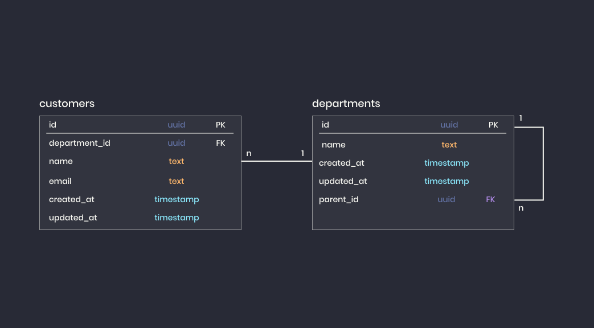

<p align="left">
   
</p>

# TypeORM Tree Entities

Learning how to work with tree entities in TypeORM

# :pushpin: Table of Contents

* [Features](#rocket-features)
* [Database Model](#clipboard-database-model)
* [Installation](#construction_worker-installation)
* [Getting Started](#runner-getting-started)
* [Build](#runner-build)
* [Application Routes](#rocket-application-routes)
* [FAQ](#postbox-faq)

# :rocket: Features

* Departments CRUD

# :clipboard: Database Model

In order to understand the entities, I've created the following database model:

<p align="left">
   
</p>

# :construction_worker: Installation

**You need to install [Node.js](https://nodejs.org/en/download/) and [Yarn](https://yarnpkg.com/) first, then in order to clone the project via HTTPS, run this command:**


```
git clone git@github.com:cunhaedu/challenge.git
```

**Install dependencies**

```
yarn install
```
Or

```
npm install
```

Create your environment variables based on the examples of ```.env.example```

```
cp .env.example .env
```

**Setup a database**

Install [Postgres](https://www.postgresql.org/) to create a database and create a database, then you should modify the ```.env``` and ```ormconfig.json``` with your credentials

# :runner: Getting Started

Run the transactions in order to configure the database schema:
```
yarn typeorm migration:run
```

Run the following command in order to start the application in a development environment:
```
yarn dev
```

# :runner: Build
Run the following command in order to convert the .ts file to .js file in a folder called dist:
```
yarn build
```

Run the following command in order to start the application in a production environment:
```
yarn start
```

## Status Codes

Check the following status codes in this API:

| Status Code | Description |
| :--- | :--- |
| 200 | `OK` |
| 400 | `BAD REQUEST` |
| 404 | `NOT FOUND` |
| 500 | `INTERNAL SERVER ERROR` |

## :postbox: Faq

**Question:** What patterns of tree entities are used in this project?

**Answer:** For now, this project use just the closure-table, that are the best way to read and write tree relations. In future, it'll contain more use examples of another patterns.

**Question:** What are the technologies used in this project?

**Answer:** The technologies used in this project are [NodeJS](https://nodejs.org/en/) + [Express Framework](http://expressjs.com/en/) to handle the server and [TypeORM](https://typeorm.io/#/)

### More...

To get more info, please see [this section of typeorm documentation](https://typeorm.io/#/tree-entities) about tree entities.
